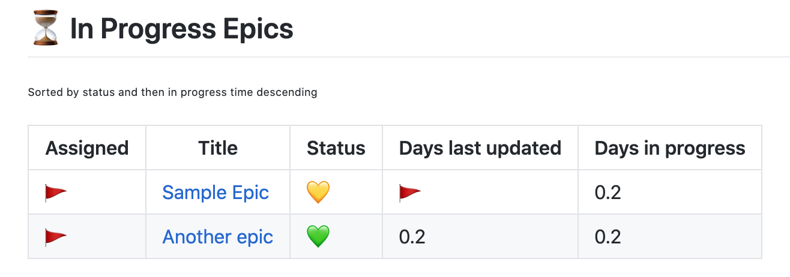

# project-in-progress



        "report-on": 'Epic',
        // TODO: implement getting a shapshot of data n days ago
        "daysAgo": 7,
        "status-label-match": "(?:green|yellow|red)",
        "wip-label-match": "(\\d+)-wip",
        "last-updated-days-flag": 3.0,
        "last-updated-scheme": "LastCommentPattern", 
        "last-updated-scheme-data": "^(#){1,4} update",

## Sample config

```yaml
reports:
..
    sections:
      - name: "project-in-progress"
        config: 
          report-on-label: 'Epic'
          status-label-match": "(?:green|yellow|red)",
          last-updated-days-flag: 3.0,
          last-updated-scheme": "LastCommentPattern", 
          last-updated-scheme-data": "^(#){1,4} [Uu]pdate",
```

## report-on-label

Filters by this label.  Typically a card type like Epic.

**Default**: `Epic`
**any**: `*` is supported which represents all cards.

<sub><sup>Note: report-on is supported for back compat</sup></sub>  
<sub><sup>Note: it will match the lower case `epic` but by using "Epic", the report heading will show "Epic"</sup></sub>

## status-label-match

Status is represented by extracting green, yellow or red out of labels.  This setting is a regex pattern.  The default pattern simply extracts those labels verbatim.  Another example would be to lool for labels like `Status: green`.

**Default**: (?:green|yellow|red)
**Other Example**: (?<=Status:).*


## last-updated-days-flag

Flag any item that hasn't been updated in these number of days.

**Default**: 3

## last-updated-scheme

The method of detecting an update.  Only LastCommentPattern is currently supported which means to get the date updated by looking at the last comment in the issue which matches a pattern. 

**Default**: LastCommentPattern

## last-updated-scheme-data

The pattern to match when looking for the last comment.   The default is to look for any comment with a markdown header of "Update"

**Default**: ^(#){1,4} [Uu]pdate
