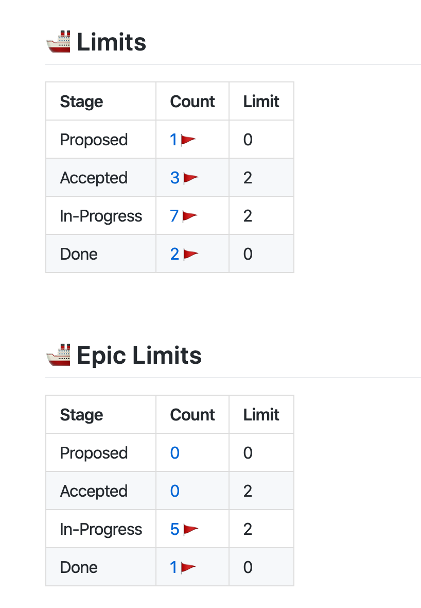

# project-limits



## Sample config

```yaml
reports:
..
    sections:
      - name: "project-limits"
        config: 
          report-on-label: 'Epic'
          accepted-limit: 2
          in-progress-limit: 2
          count-label-match: "(\\d+)-dev"
```

## report-on-label

Breakdown counts by this label.  

**Default**: `Epic` (also matches `epic` labels)
**any**: `*` is supported which represents all cards.

## count-label-match

A count is comprised by extracting a number from this label by regex pattern.  That count could represent any resource (a developer count, team count, etc).

**Default**: (\\d+)-wip"

For example, for a report filtering on `Epic`, if an `In-progress` card has an `epic` type label and a `2-wip`, then a count of two will be added to the in progress total.  If the total exceeeds the limit for that stage, it will be flagged.

## (stage)-limit

Specify a limit for the number of items allowed at a stage.  Defaults:

**proposed-limit**: 0    
**accepted-limit**: 0  
**in-progress-limit**: 4  
**done-limit**: 0  


