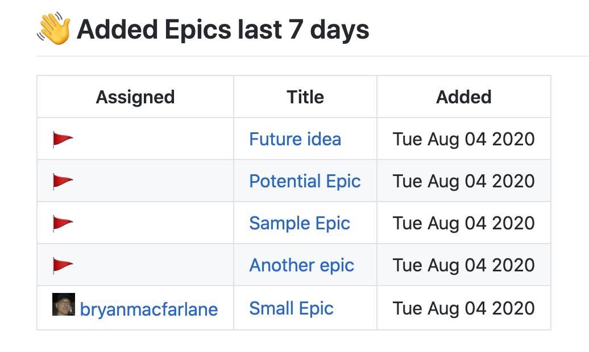

# project-new



## Sample config

```yaml
reports:
..
    sections:
      - name: "project-new"
        config: 
          report-on-label: 'Epic'
          daysAgo: 7
```

## report-on-label

Filters by this label.  Typically a card type like Epic.

**Default**: `Epic`
**any**: `*` is supported which represents all cards.

<sub><sup>Note: report-on is supported for back compat</sup></sub>  
<sub><sup>Note: it will match the lower case `epic` but by using "Epic", the report heading will show "Epic"</sup></sub>

## daysAgo

Filters by cards **added** (project_added_at) greater than this number of days ago

**Default**: 7
